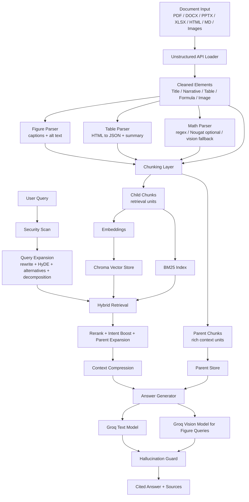
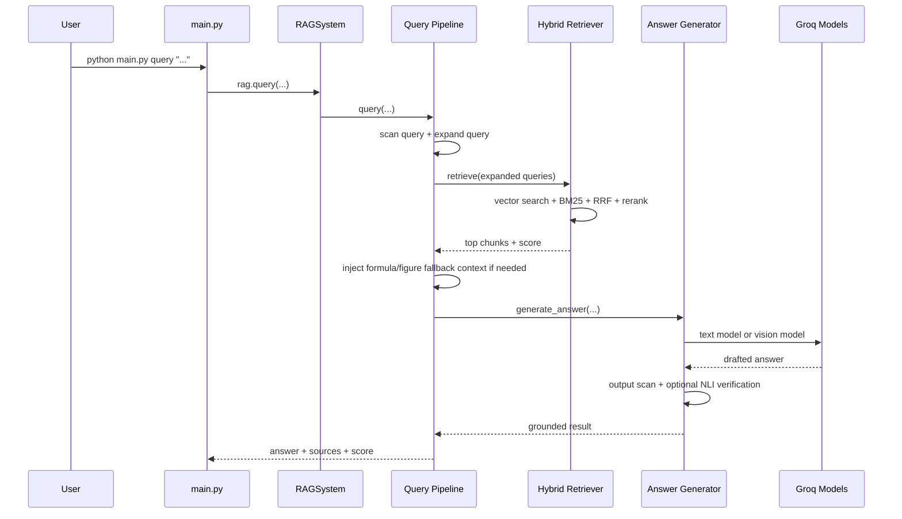

# Advanced Multimodal RAG for Technical Documents

This project is a retrieval-augmented generation (RAG) system for scientific and technical documents. It ingests PDFs and office documents, extracts narrative text plus structured content such as tables, formulas, and figures, indexes everything into a hybrid retrieval stack, and answers questions with citations.

It is designed for document-heavy workflows where plain text retrieval is not enough. The system has special handling for:

- figures and figure comparison queries
- table lookups and table comparison questions
- formula extraction and equation-focused queries
- hybrid semantic + keyword retrieval
- citation-grounded answer generation
- prompt-injection scanning and post-answer verification

## What The System Does

At a high level, the system:

1. sends a document to Unstructured for element extraction
2. enriches extracted figures, tables, and formulas
3. chunks the document into child chunks for retrieval and parent chunks for rich context
4. embeds and stores chunks in ChromaDB
5. builds a BM25 keyword index from the same chunk set
6. expands user queries into multiple retrieval-oriented variants
7. performs hybrid retrieval, reranking, and intent-aware boosting
8. generates answers with citations using Groq-hosted models
9. optionally verifies cited claims with an NLI model

## System Architecture



## Query-Time Flow



## Tech Stack

| Layer | Tooling | Why It Is Used |
| --- | --- | --- |
| Document parsing | `unstructured-client`, `unstructured[pdf,docx,pptx,xlsx,image]` | Extracts typed document elements such as titles, narrative text, formulas, tables, captions, and images. |
| Vector storage | `chromadb` | Stores embedded child chunks and parent chunks for retrieval and later context expansion. |
| Embeddings | `sentence-transformers`, `torch`, `transformers` | Generates semantic embeddings for documents and queries. Default model is `intfloat/multilingual-e5-large`. |
| Keyword retrieval | `rank-bm25` | Adds exact-term retrieval for model names, numbers, abbreviations, and low-semantic-match queries. |
| Generation | `groq` | Hosts the answer model and the vision model used for figure and image reasoning. |
| Vision answering | `meta-llama/llama-4-scout-17b-16e-instruct` | Used for figure-focused reasoning, figure comparisons, and formula vision fallback. |
| Text answering | `llama-3.3-70b-versatile` by default | Main answer model for text-heavy grounded QA. |
| Reranking | `cross-encoder/ms-marco-MiniLM-L-6-v2` | Improves precision after vector + BM25 retrieval. |
| Hallucination check | `cross-encoder/nli-deberta-v3-small` | Verifies whether cited claims are supported by retrieved chunks. |
| Context compression | `llmlingua` | Compresses retrieval context when the prompt would exceed the token budget. |
| NLP helpers | `fastcoref`, `langdetect`, `lingua-language-detector` | Improves chunk quality and language handling. |
| Utility libraries | `tiktoken`, `pandas`, `numpy`, `Pillow`, `beautifulsoup4`, `loguru`, `rich`, `tenacity`, `tqdm` | Token counting, table parsing, image composition, logging, CLI rendering, retries, and progress reporting. |

## Core Features Explained

### 1. Multiformat Document Ingestion

The system can ingest:

- PDF
- DOCX
- PPTX
- XLSX
- HTML
- Markdown
- PNG
- JPG

`RAGSystem.ingest()` handles single files and `RAGSystem.ingest_directory()` walks directories and ingests all supported files.

### 2. Typed Element Extraction

The ingestion pipeline does not treat the document as one long string. It keeps structural types such as:

- `Title`
- `NarrativeText`
- `ListItem`
- `Table`
- `Formula`
- `Image`
- `FigureCaption` / `Caption`

This is important because tables, formulas, and images need different retrieval and prompting behavior from plain text.

### 3. Figure Parsing And Vision-Aware Figure QA

Figure handling is one of the strongest custom parts of the system.

Implemented behavior:

- captions are attached to nearby image elements
- figures are converted into searchable chunks
- figure chunks preserve caption, alt text, and image metadata
- figure-count queries can enumerate available figures
- figure-specific questions such as `Explain Figure 2` route through a dedicated figure answer path
- two-figure comparison questions such as `Figure 3 vs Figure 4` build a side-by-side composite image and send it to the vision model
- when stored image bytes are missing, the system can render the PDF page on demand and still use the vision model

Relevant modules:

- `ingestion/parsers/figure_parser.py`
- `pipeline/query_pipeline.py`
- `generation/answer_generator.py`
- `generation/llm_client.py`

### 4. Table Extraction And Table QA

Tables are not only stored as plain text.

The system:

- preserves raw table HTML from Unstructured
- converts table content into structured JSON
- stores headers, rows, and caption metadata
- reconstructs table content at prompt time
- supports metric lookups, row/column-style questions, and table comparison prompts better than text-only RAG

This is why queries like comparing `Table 1` and `Table 2` can be answered from structured data rather than from vague narrative summaries.

Relevant modules:

- `ingestion/parsers/table_parser.py`
- `retrieval/context_compressor.py`
- `generation/answer_generator.py`

### 5. Formula Extraction And Equation QA

Formula extraction is handled separately from generic OCR.

The current implementation supports:

- regex-based extraction from formula-like text
- optional Nougat support if enabled
- a vision-based fallback for corrupted formulas when `USE_FORMULA_VISION_FALLBACK=true`
- equation-specific prompting and answer logic
- corruption detection so bad OCR is marked as corrupted instead of silently hallucinated into a clean equation

Relevant modules:

- `ingestion/parsers/math_parser.py`
- `pipeline/query_pipeline.py`
- `generation/answer_generator.py`

### 6. Section-Aware Chunking

The chunker is not a naive fixed-window splitter.

It:

- keeps section headings attached to text chunks
- uses overlapping chunks to preserve continuity
- keeps tables, figures, formulas, and code snippets as standalone chunks
- builds both child chunks and parent chunks

Child chunks are optimized for retrieval.

Parent chunks are optimized for answer-time context expansion.

Relevant module:

- `ingestion/chunking.py`

### 7. Hierarchical Parent-Child Indexing

This system uses a two-level context model:

- child chunks are indexed for search
- parent chunks are fetched later when richer textual context is needed

This improves precision during retrieval without forcing generation to work from tiny fragments.

Relevant module:

- `ingestion/chunking.py`
- `indexing/vector_store.py`

### 8. Hybrid Retrieval

The retriever combines:

- vector search from Chroma
- BM25 keyword search
- reciprocal rank fusion
- cross-encoder reranking
- structured chunk boosting
- intent-aware promotion for formulas, tables, and figures

This matters because semantic retrieval alone often misses:

- exact metric names
- figure labels
- formula-related queries
- rare model names
- table cell lookups

Relevant module:

- `retrieval/hybrid_retriever.py`

### 9. Query Expansion

Before retrieval, the system expands the question using several techniques:

- retrieval-oriented rewriting
- HyDE hypothetical answer generation
- alternative phrasings
- compound-question decomposition

This increases recall, especially for technical and comparison queries.

Relevant module:

- `retrieval/query_expander.py`

### 10. Figure / Table / Formula Intent Routing

The query pipeline has domain-specific fallback behavior.

Examples:

- formula intent can inject formula chunks if the main retriever misses them
- figure intent can inject image chunks if the relevance gate would otherwise return no answer
- figure comparisons use a custom comparison path instead of generic text generation

This is one of the main differences between this codebase and a generic off-the-shelf RAG template.

Relevant modules:

- `pipeline/query_pipeline.py`
- `generation/answer_generator.py`

### 11. Context Compression

Long retrieval results can exceed model budgets. The system handles that by:

- checking total token count
- attempting LLMLingua compression
- falling back to score-based smart chunk selection
- preserving reading order after selection

Relevant module:

- `retrieval/context_compressor.py`

### 12. Citation-Grounded Answer Generation

The final answer prompt is built from reconstructed structured content, not just the embedded text.

That means:

- formulas are shown back to the model as LaTeX
- tables are shown as headers and rows
- figures are shown using figure description and captions
- every factual claim is expected to cite `[Source N]`

Relevant module:

- `generation/answer_generator.py`

### 13. Vision Model Routing For Figure Questions

The system uses a dedicated Groq vision model for image-aware questions:

- `meta-llama/llama-4-scout-17b-16e-instruct`

This is configured through `VISION_MODEL` and used by `LLMClient.complete_vision()`.

Figure-specific answer flows call the vision model directly instead of relying on the text model alone.

Relevant module:

- `generation/llm_client.py`

### 14. Prompt Injection Defenses

There are multiple safety layers:

- user query scanning
- retrieved chunk scanning
- output scanning for suspicious instruction leakage

Flagged chunks are sanitized instead of being silently trusted.

Relevant module:

- `generation/security.py`

### 15. Hallucination Guard

After answer generation, the system can run an NLI-based verification step that:

- extracts cited claims
- maps them to source chunks
- tests whether the source entails the claim
- returns warnings for unsupported claims

The verifier currently fails open if the NLI model itself errors, so the system remains usable during model/tokenizer issues.

Relevant module:

- `generation/hallucination_guard.py`

### 16. Versioning And Soft Delete

When a file is re-ingested:

- the file hash becomes the document version
- previous versions are marked deprecated instead of hard-deleted
- retrieval excludes deprecated chunks by default
- recency can add a small retrieval bonus

This makes re-ingestion safer and avoids duplicate live copies of the same document version.

Relevant modules:

- `ingestion/versioning.py`
- `indexing/vector_store.py`

### 17. BM25 Persistence

The keyword index is cached on disk as `bm25_index.pkl`.

Startup behavior:

- try loading the cache
- if missing, rebuild from all non-deprecated vector-store chunks

Relevant module:

- `indexing/bm25_index.py`

### 18. Rich CLI

The project includes a usable CLI with:

- `ingest`
- `query`
- `interactive`
- `stats`

It prints:

- answer panels
- source tables
- retrieval score
- chunk count
- expanded query count

Relevant module:

- `main.py`

## Repository Structure

```text
RAG_A/
|-- config/
|   |-- settings.py
|-- generation/
|   |-- answer_generator.py
|   |-- hallucination_guard.py
|   |-- llm_client.py
|   `-- security.py
|-- indexing/
|   |-- bm25_index.py
|   |-- embeddings.py
|   |-- metadata.py
|   `-- vector_store.py
|-- ingestion/
|   |-- chunking.py
|   |-- document_loader.py
|   |-- versioning.py
|   `-- parsers/
|       |-- figure_parser.py
|       |-- math_parser.py
|       |-- nougat_processor.py
|       `-- table_parser.py
|-- pipeline/
|   |-- ingestion_pipeline.py
|   `-- query_pipeline.py
|-- retrieval/
|   |-- context_compressor.py
|   |-- hybrid_retriever.py
|   `-- query_expander.py
|-- utils/
|   |-- logger.py
|   |-- language_detector.py
|   `-- coref_resolver.py
|-- main.py
|-- rag_system.py
|-- requirements.txt
`-- .env
```

## Installation

### 1. Create A Virtual Environment

```powershell
python -m venv envcf
.\envcf\Scripts\Activate.ps1
```

### 2. Install Dependencies

```powershell
pip install -r requirements.txt
```

### 3. Configure Environment Variables

Create `.env` from `.env.example` and set at least:

```env
UNSTRUCTURED_API_KEY=your_unstructured_api_key
GROQ_API_KEY=your_groq_api_key
LLM_MODEL=llama-3.3-70b-versatile
VISION_MODEL=meta-llama/llama-4-scout-17b-16e-instruct
DEFAULT_EMBEDDING_MODEL=intfloat/multilingual-e5-large
CHROMA_PERSIST_DIR=./chroma_db
COLLECTION_NAME=rag_collection
RELEVANCE_THRESHOLD=0.10
USE_NOUGAT=false
USE_FORMULA_VISION_FALLBACK=true
```

## Important Configuration Options

| Variable | Purpose |
| --- | --- |
| `LLM_MODEL` | Main text-only answer model. |
| `VISION_MODEL` | Vision model used for figure reasoning and image-aware answering. |
| `DEFAULT_EMBEDDING_MODEL` | Default embedding model for indexing and query retrieval. |
| `AUTO_DETECT_EMBEDDING_DOMAIN` | If `true`, can switch embedding families based on detected domain. Usually keep `false` for collection consistency. |
| `VECTOR_SEARCH_TOP_K` | Candidate count from vector retrieval. |
| `BM25_TOP_K` | Candidate count from BM25 retrieval. |
| `RERANK_TOP_K` | Final candidate count after reranking. |
| `RELEVANCE_THRESHOLD` | Minimum top score before the system returns a no-answer response. |
| `MAX_CONTEXT_TOKENS` | Prompt budget before compression is applied. |
| `USE_NOUGAT` | Enables Nougat for formula/table extraction if available. |
| `USE_FORMULA_VISION_FALLBACK` | Uses the vision model to rescue corrupted formula extraction. |
| `RECENCY_DECAY_DAYS` | Controls recency bonus applied to newer ingestions. |

## Usage

### Ingest A Single File

```powershell
python main.py ingest .\docs\paper.pdf
```

### Ingest A Directory

```powershell
python main.py ingest .\docs
```

### Ask A Question

```powershell
python main.py query "What is the difference between Table 1 and Table 2?"
```

### Ask A Figure Question

```powershell
python main.py query "Kindly explain Figure 2 properly"
python main.py query "What is the difference between Figure 3 and Figure 4?"
python main.py query "How many figures are there?"
```

### Ask A Formula Question

```powershell
python main.py query "mention the loss function equation"
python main.py query "Properly mention all the equations in the pdf"
```

### Interactive Mode

```powershell
python main.py interactive
```

### Show Stats

```powershell
python main.py stats
```

## Typical Ingestion Output

After a successful ingest, the system reports:

- file name
- ingest status
- child chunk count
- selected embedding domain
- figure/table/formula counts
- total indexed chunks

## Typical Query Output

Each query returns:

- answer text
- grounding status
- flagged claims, if any
- cited sources table
- retrieval score
- number of retrieved chunks
- number of expanded queries

## Design Choices

### Why Hybrid Retrieval Instead Of Vector Search Only

Technical documents contain:

- exact metric names
- model names
- figure labels
- equation identifiers
- low-frequency terminology

BM25 catches lexical matches that embeddings often soften away. The reranker then recovers precision.

### Why Structured Chunks Are Preserved

Tables, formulas, and figures are not flattened into generic text because that loses:

- table cell boundaries
- LaTeX structure
- figure captions and visual metadata

Preserving structured chunks is what allows the system to answer document-specific questions more faithfully.

### Why Parent Chunks Exist Alongside Child Chunks

Small chunks are better for retrieval.

Bigger chunks are better for explanation.

Parent-child indexing gives the system both without making retrieval too fuzzy.

## Known Operational Notes

- If you change embedding families, clear `chroma_db` and `bm25_index.pkl` and re-ingest.
- If a figure chunk has no stored image bytes, the query path can render the source PDF page on demand for vision answering.
- Formula extraction quality depends heavily on the source PDF and OCR quality.
- NLI verification can fail open if the verifier model or tokenizer has runtime issues.

## Generated Local Artifacts

These files are created during normal use:

- `chroma_db/`
- `bm25_index.pkl`
- `version_registry.json`
- `logs/`

## Recommended README Use Cases

This README is intended to help:

- developers extending the ingestion or retrieval stack
- researchers using the CLI for document question answering
- teams debugging figure/table/formula behavior
- contributors who need a map of the full architecture before changing code

