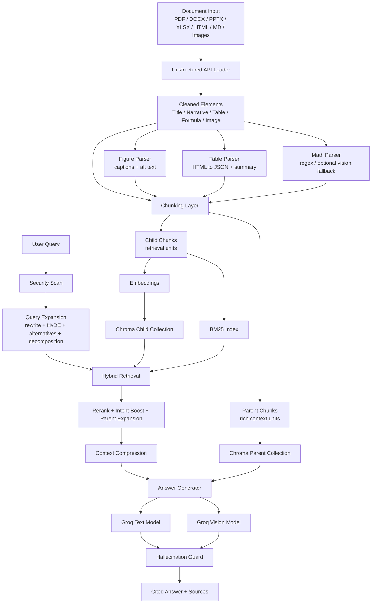
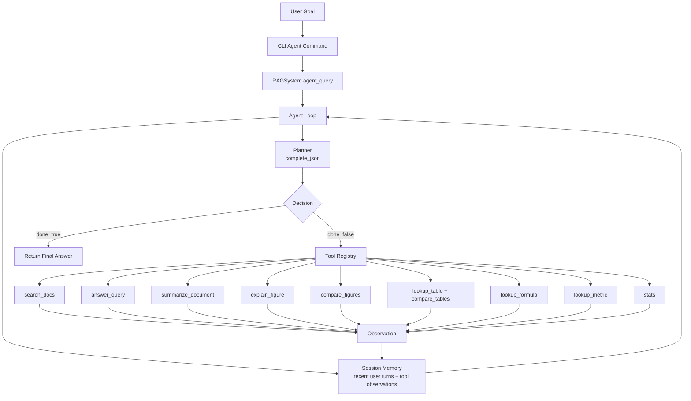
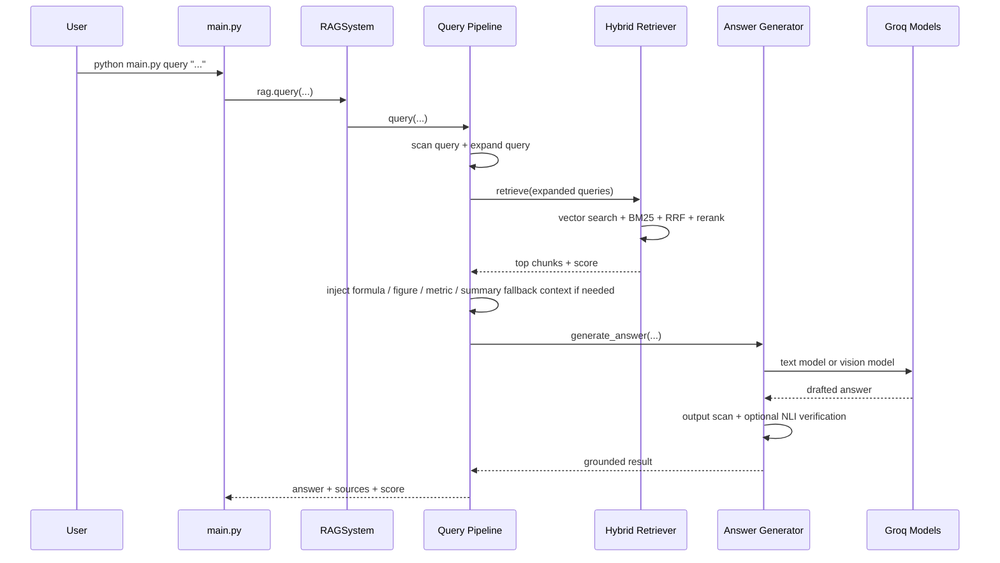
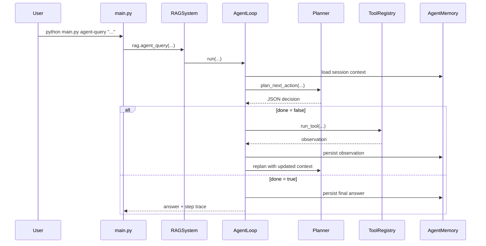

# Advanced Multimodal Agentic RAG for Technical Documents

This project is a multimodal, citation-grounded Retrieval-Augmented Generation system for scientific and technical documents. It ingests PDFs and office documents, extracts narrative text plus structured content such as tables, formulas, and figures, indexes everything into a hybrid retrieval stack, and answers questions through both:

- a direct routed RAG pipeline
- an agentic planner-and-tools loop

The system is designed for document-heavy workflows where plain text retrieval is not enough and where some questions are better answered in one pass while others benefit from multi-step orchestration.

## What The System Does

At a high level, the system:

1. parses documents into typed elements with Unstructured
2. enriches tables, formulas, and figures
3. chunks the document into retrieval chunks and parent context chunks
4. embeds and stores the chunks in ChromaDB
5. builds a BM25 keyword index from the same chunk set
6. expands user queries into multiple retrieval-oriented variants
7. performs hybrid retrieval, reranking, and intent-aware boosting
8. routes the question either through direct RAG or through an agent loop
9. generates answers with citations using Groq-hosted text and vision models
10. optionally verifies cited claims with an NLI model

## System Modes

The codebase now has two execution modes.

### 1. Direct RAG Mode

This is the fast path for straightforward questions such as:

- `Explain Figure 2`
- `What is the R2 score of Random Forest Regressor model`
- `What is the difference between Table 1 and Table 2`

This mode uses the existing routed pipeline in [`query_pipeline.py`](./pipeline/query_pipeline.py) and specialized answer logic in [`answer_generator.py`](./generation/answer_generator.py).

### 2. Agentic Mode

This is the multi-step path for more complex tasks such as:

- summarizing a document and then answering a follow-up
- choosing between figure, table, metric, and general retrieval tools
- breaking a task into search, inspect, compare, and answer steps
- maintaining a lightweight session memory across turns

This mode uses:

- [`planner.py`](./agent/planner.py) for JSON planning and replanning
- [`tool_registry.py`](./agent/tool_registry.py) for explicit tools
- [`agent_loop.py`](./agent/agent_loop.py) for the plan-act-observe loop
- [`memory.py`](./agent/memory.py) for session persistence

## High-Level Architecture

### Base Multimodal RAG Architecture



### Agentic Orchestration Architecture



### Query-Time Sequence For Direct RAG



### Query-Time Sequence For Agent Mode



## Core Design Philosophy

This repository deliberately does not treat all questions the same.

- Direct factual and structured-document questions should be answered quickly with deterministic routing.
- Complex tasks should be decomposed into explicit tool calls.
- Tables, formulas, and figures are preserved as structured chunks instead of flattened into plain text.
- The agent layer should orchestrate the existing RAG system, not replace it.

That design keeps the fast path fast, while still allowing multi-step behavior when it is useful.

## Tech Stack

| Layer | Tooling | Why It Is Used |
| --- | --- | --- |
| Document parsing | `unstructured-client`, `unstructured[pdf,docx,pptx,xlsx,image]` | Extracts typed document elements such as titles, narrative text, formulas, tables, captions, and images. |
| Vector storage | `chromadb` | Stores embedded child chunks and parent chunks for retrieval and later context expansion. |
| Embeddings | `sentence-transformers`, `torch`, `transformers` | Generates semantic embeddings for documents and queries. Default model is `intfloat/multilingual-e5-large`. |
| Keyword retrieval | `rank-bm25` | Adds exact-term retrieval for model names, numbers, abbreviations, and low-semantic-match queries. |
| Text generation | `groq` | Hosts the main answer model and planner JSON generation. |
| Vision generation | `meta-llama/llama-4-scout-17b-16e-instruct` | Used for figure-focused reasoning, figure comparisons, and image-aware answering. |
| Main answer model | `llama-3.3-70b-versatile` | Used for grounded text generation, query expansion, and direct answers. |
| Planner output control | `complete_json()` via Groq JSON mode | Forces structured planner decisions for the agent loop. |
| Reranking | `cross-encoder/ms-marco-MiniLM-L-6-v2` | Improves precision after vector + BM25 retrieval. |
| Hallucination check | `cross-encoder/nli-deberta-v3-small` | Verifies whether cited claims are supported by retrieved chunks. |
| Context compression | `llmlingua` | Compresses retrieval context when the prompt would exceed the token budget. |
| NLP helpers | `fastcoref`, `langdetect`, `lingua-language-detector` | Improves chunk quality and language handling. |
| Utility libraries | `tiktoken`, `pandas`, `numpy`, `Pillow`, `beautifulsoup4`, `loguru`, `rich`, `tenacity`, `tqdm` | Token counting, table parsing, image composition, logging, CLI rendering, retries, and progress reporting. |

## Repository Structure

```text
RAG_A/
|-- agent/
|   |-- agent_loop.py
|   |-- memory.py
|   |-- planner.py
|   |-- tool_registry.py
|   `-- __init__.py
|-- config/
|   |-- settings.py
|-- generation/
|   |-- answer_generator.py
|   |-- hallucination_guard.py
|   |-- llm_client.py
|   `-- security.py
|-- indexing/
|   |-- bm25_index.py
|   |-- embeddings.py
|   |-- metadata.py
|   `-- vector_store.py
|-- ingestion/
|   |-- chunking.py
|   |-- document_loader.py
|   |-- versioning.py
|   `-- parsers/
|       |-- figure_parser.py
|       |-- math_parser.py
|       `-- table_parser.py
|-- pipeline/
|   |-- ingestion_pipeline.py
|   `-- query_pipeline.py
|-- retrieval/
|   |-- context_compressor.py
|   |-- hybrid_retriever.py
|   `-- query_expander.py
|-- utils/
|   |-- logger.py
|   |-- language_detector.py
|   `-- coref_resolver.py
|-- main.py
|-- rag_system.py
|-- requirements.txt
`-- .env
```

## Detailed Component Walkthrough

### 1. Multiformat Document Ingestion

The system can ingest:

- PDF
- DOCX
- PPTX
- XLSX
- HTML
- Markdown
- PNG
- JPG

[`rag_system.py`](./rag_system.py) exposes:

- `RAGSystem.ingest()` for single files
- `RAGSystem.ingest_directory()` for directory ingestion

[`ingestion_pipeline.py`](./pipeline/ingestion_pipeline.py) coordinates parsing, chunking, embedding, indexing, and BM25 rebuilding.

### 2. Typed Element Extraction

The ingestion pipeline does not flatten the whole document into a single text blob. It preserves element types such as:

- `Title`
- `NarrativeText`
- `ListItem`
- `Table`
- `Formula`
- `Image`
- `FigureCaption` / `Caption`

This matters because tables, formulas, and images need different retrieval, prompting, and reconstruction behavior than normal prose.

### 3. Figure Parsing And Vision-Aware Figure QA

Figure handling is one of the strongest custom parts of the system.

Implemented behavior:

- captions are attached to nearby image elements
- figures are converted into searchable chunks
- figure chunks preserve caption, alt text, and image metadata
- figure-count queries can enumerate available figures
- figure-specific questions such as `Explain Figure 2` route through a dedicated figure answer path
- two-figure comparison questions build a side-by-side composite and send it to the vision model
- when stored image bytes are missing, the system can render the PDF page on demand and still use the vision model

Relevant modules:

- [`figure_parser.py`](./ingestion/parsers/figure_parser.py)
- [`query_pipeline.py`](./pipeline/query_pipeline.py)
- [`answer_generator.py`](./generation/answer_generator.py)
- [`llm_client.py`](./generation/llm_client.py)

### 4. Table Extraction And Table QA

Tables are not stored as plain text alone.

The system:

- preserves raw table HTML from Unstructured
- converts table content into structured JSON
- stores headers, rows, and caption metadata
- reconstructs table content at prompt time
- supports metric lookups, row/column-style questions, and table comparison prompts better than text-only RAG

This is why comparing `Table 1` and `Table 2` can be answered from structured content rather than vague narrative text.

Relevant modules:

- [`table_parser.py`](./ingestion/parsers/table_parser.py)
- [`context_compressor.py`](./retrieval/context_compressor.py)
- [`answer_generator.py`](./generation/answer_generator.py)

### 5. Formula Extraction And Equation QA

Formula extraction is handled separately from generic OCR.

The current implementation supports:

- regex-based extraction from formula-like text
- a vision-based fallback for corrupted formulas when `USE_FORMULA_VISION_FALLBACK=true`
- equation-specific prompting and answer logic
- corruption detection so bad OCR is marked as corrupted instead of silently hallucinated into clean equations

Relevant modules:

- [`math_parser.py`](./ingestion/parsers/math_parser.py)
- [`query_pipeline.py`](./pipeline/query_pipeline.py)
- [`answer_generator.py`](./generation/answer_generator.py)

### 6. Section-Aware Chunking

[`chunking.py`](./ingestion/chunking.py) is not a naive fixed-window splitter.

It:

- keeps section headings attached to text chunks
- uses overlapping chunks to preserve continuity
- keeps tables, figures, formulas, and code snippets as standalone chunks
- builds both child chunks and parent chunks

Child chunks are optimized for retrieval.

Parent chunks are optimized for answer-time context expansion.

### 7. Hierarchical Parent-Child Indexing

This system uses a two-level context model:

- child chunks are indexed for search
- parent chunks are fetched later when richer textual context is needed

This improves retrieval precision without forcing the generator to work from tiny fragments.

Relevant modules:

- [`chunking.py`](./ingestion/chunking.py)
- [`vector_store.py`](./indexing/vector_store.py)

### 8. Hybrid Retrieval

[`hybrid_retriever.py`](./retrieval/hybrid_retriever.py) combines:

- vector search from Chroma
- BM25 keyword search
- reciprocal rank fusion
- cross-encoder reranking
- structured chunk boosting
- intent-aware promotion for formulas, tables, figures, summaries, and metrics

This matters because semantic retrieval alone often misses:

- exact metric names
- figure labels
- formula queries
- rare model names
- table cell lookups
- broad summary queries

### 9. Query Expansion

Before retrieval, the system expands the question using several techniques:

- retrieval-oriented rewriting
- HyDE hypothetical answer generation
- alternative phrasings
- compound-question decomposition

This increases recall, especially for technical and comparison queries.

Relevant module:

- [`query_expander.py`](./retrieval/query_expander.py)

### 10. Intent Routing And Retrieval Fallbacks

[`query_pipeline.py`](./pipeline/query_pipeline.py) has domain-specific fallback behavior.

Examples:

- formula intent can inject formula chunks if the main retriever misses them
- figure intent can inject image chunks if the relevance gate would otherwise return no answer
- metric-intent queries can inject likely model/metric chunks even when lexical overlap is weak
- summary-intent queries can inject parent chunks for document-level summarization

This is one of the key differences between this codebase and a generic template RAG system.

### 11. Context Compression

Long retrieval results can exceed model budgets. The system handles that by:

- checking total token count
- attempting LLMLingua compression
- falling back to smart chunk selection
- preserving reading order after selection

Relevant module:

- [`context_compressor.py`](./retrieval/context_compressor.py)

### 12. Citation-Grounded Answer Generation

The final answer prompt is built from reconstructed structured content, not just embedded text.

That means:

- formulas are shown back to the model as LaTeX
- tables are shown as headers and rows
- figures are shown using figure description and captions
- every factual claim is expected to cite `[Source N]`

Relevant module:

- [`answer_generator.py`](./generation/answer_generator.py)

### 13. Vision Model Routing

The system uses a dedicated Groq vision model for image-aware questions:

- `meta-llama/llama-4-scout-17b-16e-instruct`

This is configured through `VISION_MODEL` and used by `LLMClient.complete_vision()`.

Figure-specific and multi-figure comparison flows call the vision model directly instead of relying only on the text model.

### 14. Prompt Injection Defenses

There are multiple safety layers:

- user query scanning
- retrieved chunk scanning
- output scanning for suspicious instruction leakage

Flagged chunks are sanitized instead of being silently trusted.

Relevant module:

- [`security.py`](./generation/security.py)

### 15. Hallucination Guard

After answer generation, the system can run an NLI-based verification step that:

- extracts cited claims
- maps them to source chunks
- tests whether the source entails the claim
- returns warnings for unsupported claims

The verifier currently fails open if the NLI model itself errors, so the system remains usable during model or tokenizer issues.

Relevant module:

- [`hallucination_guard.py`](./generation/hallucination_guard.py)

### 16. Versioning And Soft Delete

When a file is re-ingested:

- the file hash becomes the document version
- previous versions are marked deprecated instead of hard-deleted
- retrieval excludes deprecated chunks by default
- recency can add a small retrieval bonus

This makes re-ingestion safer and avoids duplicate live copies of the same document version.

Relevant modules:

- [`versioning.py`](./ingestion/versioning.py)
- [`vector_store.py`](./indexing/vector_store.py)

### 17. BM25 Persistence

The keyword index is cached on disk as `bm25_index.pkl`.

Startup behavior:

- try loading the cache
- if missing, rebuild from all non-deprecated vector-store chunks

Relevant module:

- [`bm25_index.py`](./indexing/bm25_index.py)

## Agentic Layer Explained In Detail

### Why Add An Agent Layer

The base system is already strong for one-shot document QA, but some tasks need more than one retrieval pass.

Examples:

- first search the document, then inspect a figure, then compare with narrative text
- summarize a paper before answering a model-performance question
- choose between table, figure, formula, or general QA tools based on the question

The agent layer solves that by separating:

- planning
- tool use
- observation capture
- replanning
- final answer synthesis

### Planner

[`planner.py`](./agent/planner.py) uses `LLMClient.complete_json()` to force the planner to emit a structured decision:

- `thought`
- `tool_name`
- `tool_input`
- `done`
- `final_answer`

This lets the orchestration loop work with deterministic JSON decisions rather than brittle free-form text parsing.

### Tool Registry

[`tool_registry.py`](./agent/tool_registry.py) turns the current capabilities into explicit tools.

Current tools:

- `search_docs`
- `answer_query`
- `summarize_document`
- `explain_figure`
- `compare_figures`
- `lookup_table`
- `compare_tables`
- `lookup_formula`
- `lookup_metric`
- `stats`

The important design point is that these tools reuse the current RAG pipeline rather than rebuilding a second, inconsistent retrieval system.

### Agent Loop

[`agent_loop.py`](./agent/agent_loop.py) runs a simple plan-act-observe loop:

1. load prior session context
2. ask the planner for the next action
3. run the requested tool
4. store the observation
5. replan
6. stop when the planner marks the task as complete or when the step budget is exhausted

### Session Memory

[`memory.py`](./agent/memory.py) stores lightweight session state in JSON files under `AGENT_MEMORY_DIR`.

Each session records:

- user turns
- tool calls
- tool inputs
- tool observations
- final assistant answers

This gives the agent continuity across multiple CLI turns without introducing a heavyweight external memory service.

### Fallback Behavior

The planner has a fallback path for situations where JSON planning fails, such as API connection issues.

For example:

- document-summary queries fall back to `summarize_document`
- other queries fall back to `answer_query`
- if a prior step already produced a good observation, the agent can finish with that result

This makes the agent layer more robust and keeps CLI operation usable even when planner calls are imperfect.

## CLI Reference

The entire system is CLI-controlled through [`main.py`](./main.py).

### Core Commands

#### Ingest A Single File

```powershell
python main.py ingest .\docs\paper.pdf
```

#### Ingest A Directory

```powershell
python main.py ingest .\docs
```

#### Query Command With Automatic Routing

```powershell
python main.py query "What is the difference between Table 1 and Table 2?"
python main.py query "Compare figure 2 and figure 3, then summarize the result" --show-trace
python main.py query "What is the R2 score of Random Forest Regressor model"
```

`query` now auto-decides whether to use direct RAG or the agent loop.

Use these flags when you want manual control:

```powershell
python main.py query "what is the pdf about" --direct
python main.py query "what is the pdf about" --agent --show-trace
```

#### Direct Interactive Mode

```powershell
python main.py interactive
```

#### System Stats

```powershell
python main.py stats
```

### Agent Commands

#### List Available Agent Tools

```powershell
python main.py tools
python main.py route "Compare figure 2 and figure 3, then summarize the result"
```

#### Execute One Explicit Tool

```powershell
python main.py tool stats --show-json
python main.py tool lookup_metric --input "{\"model_name\":\"Random Forest Regressor\",\"metric_name\":\"R2\"}"
python main.py tool explain_figure --input "{\"figure_number\":2}"
```

#### Run The Agent Loop For One Query

```powershell
python main.py agent-query "what is the pdf about" --show-trace
python main.py agent-query "Compare figure 2 and figure 3, then summarize the result" --session paper1 --show-trace
```

#### Interactive Agent Mode

```powershell
python main.py agent-interactive --session paper1 --show-trace
```

### Useful Query Examples

#### Figure Queries

```powershell
python main.py query "Kindly explain Figure 2 properly"
python main.py query "What is the difference between Figure 3 and Figure 4?"
python main.py query "How many figures are there?"
```

#### Table Queries

```powershell
python main.py query "Explain Table 2 briefly and state its contents"
python main.py query "What is the difference between Table 1 and Table 2?"
```

#### Formula Queries

```powershell
python main.py query "mention the loss function equation"
python main.py query "Properly mention all the equations in the pdf"
```

#### Metric Queries

```powershell
python main.py query "What is the R2 score of Random Forest Regressor model"
python main.py tool lookup_metric --input "{\"model_name\":\"Random Forest Regressor\",\"metric_name\":\"R2\"}"
```

#### Summary Queries

```powershell
python main.py query "Summary of pdf"
python main.py query "what is the pdf about"
python main.py tool summarize_document
```

## Important Configuration Options

Create `.env` from `.env.example` and set at least:

```env
UNSTRUCTURED_API_KEY=your_unstructured_api_key
GROQ_API_KEY=your_groq_api_key
LLM_MODEL=llama-3.3-70b-versatile
VISION_MODEL=meta-llama/llama-4-scout-17b-16e-instruct
DEFAULT_EMBEDDING_MODEL=intfloat/multilingual-e5-large
CHROMA_PERSIST_DIR=./chroma_db
COLLECTION_NAME=rag_collection
RELEVANCE_THRESHOLD=0.10
USE_FORMULA_VISION_FALLBACK=true
AUTO_ROUTE_QUERIES=true
AGENT_MAX_STEPS=5
AGENT_MEMORY_DIR=./agent_sessions
```

### Configuration Reference

| Variable | Purpose |
| --- | --- |
| `LLM_MODEL` | Main text-only answer model. |
| `VISION_MODEL` | Vision model used for figure reasoning and image-aware answering. |
| `DEFAULT_EMBEDDING_MODEL` | Default embedding model for indexing and query retrieval. |
| `AUTO_DETECT_EMBEDDING_DOMAIN` | If `true`, can switch embedding families based on detected domain. Usually keep `false` for collection consistency. |
| `VECTOR_SEARCH_TOP_K` | Candidate count from vector retrieval. |
| `BM25_TOP_K` | Candidate count from BM25 retrieval. |
| `RERANK_TOP_K` | Final candidate count after reranking. |
| `RELEVANCE_THRESHOLD` | Minimum top score before the system returns a no-answer response. |
| `MAX_CONTEXT_TOKENS` | Prompt budget before compression is applied. |
| `USE_FORMULA_VISION_FALLBACK` | Uses the vision model to rescue corrupted formula extraction. |
| `RECENCY_DECAY_DAYS` | Controls recency bonus applied to newer ingestions. |
| `AUTO_ROUTE_QUERIES` | Enables automatic direct-vs-agent routing in the standard `query` command. |
| `AGENT_MAX_STEPS` | Maximum number of planner-tool-replan cycles in one agent run. |
| `AGENT_MEMORY_DIR` | Directory where session memory JSON files are stored. |
| `TOOL_PROMPT_*` | Lets you customize tool wrapper prompts from `.env` without editing code. |

## Typical Outputs

### Typical Ingestion Output

After a successful ingest, the system reports:

- file name
- ingest status
- child chunk count
- selected embedding domain
- figure/table/formula counts
- total indexed chunks

### Typical Direct Query Output

Each direct query returns:

- answer text
- grounding status
- flagged claims, if any
- cited sources table
- retrieval score
- number of retrieved chunks
- number of expanded queries

### Typical Agent Output

Each agent query returns:

- final answer
- session ID
- number of steps used
- halt reason
- optional tool trace when `--show-trace` is enabled

## Design Choices

### Why Hybrid Retrieval Instead Of Vector Search Only

Technical documents contain:

- exact metric names
- model names
- figure labels
- equation identifiers
- low-frequency terminology

BM25 catches lexical matches that embeddings often soften away. The reranker then recovers precision.

### Why Structured Chunks Are Preserved

Tables, formulas, and figures are not flattened into generic text because that loses:

- table cell boundaries
- LaTeX structure
- figure captions and visual metadata

Preserving structured chunks is what allows the system to answer document-specific questions more faithfully.

### Why Parent Chunks Exist Alongside Child Chunks

Small chunks are better for retrieval.

Bigger chunks are better for explanation.

Parent-child indexing gives the system both without making retrieval too fuzzy.

### Why Toolize The Existing System Instead Of Replacing It

The current routed RAG stack already contains specialized logic for:

- figures
- formulas
- tables
- metrics
- summaries

The tool registry reuses that logic so the agent remains consistent with the existing retrieval and answer pathways.

### Why Not Make Every Query Agentic

One-shot factual questions are faster and simpler through the direct RAG path.

The agent loop is most useful when the question benefits from:

- tool choice
- multiple steps
- observation-driven replanning
- session continuity

## Known Operational Notes

- If you change embedding families, clear `chroma_db` and `bm25_index.pkl` and re-ingest.
- If a figure chunk has no stored image bytes, the query path can render the source PDF page on demand for vision answering.
- Formula extraction quality depends heavily on the source PDF and OCR quality.
- NLI verification can fail open if the verifier model or tokenizer has runtime issues.
- Agent mode depends on JSON planner calls to the LLM; planner fallback logic exists, but network/API failures can still slow or degrade the experience.

## Generated Local Artifacts

These files are created during normal use:

- `chroma_db/`
- `bm25_index.pkl`
- `version_registry.json`
- `logs/`
- `agent_sessions/`

## Recommended Use Cases

This README is intended to help:

- developers extending ingestion, retrieval, or agent orchestration
- researchers using the CLI for document question answering
- teams debugging figure/table/formula behavior
- contributors who need a map of the full architecture before changing code
- users who want to understand when to use direct query mode versus agent mode
